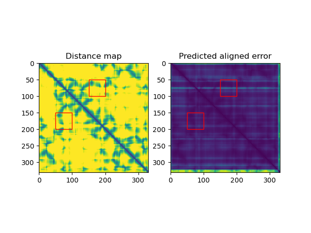

# dgram2dmap

Converts AlphaFold distograms into distance matrices and saves them into a number of formats.


# Usage 

```
dgram2dmap.py [-h] [--maxD 20.0] [--limits i:j k:l] [--chains chain1 chain2] [--plot] [--rosetta] in_folder

Extract and format distance constraints from AlphaFold distograms

positional arguments:
  in_folder             AlphaFold model output folder

optional arguments:
  -h, --help            show this help message and exit
  --maxD 20.0           Maximum distance (in Å) for constraints output
  --limits i:j k:l      Select a 'patch' of constraints between two subsets of residues (e.g. 0:100 200:300)
  --chains chain1 chain2
                        Extract constraints between two chains (e.g. A B)
  --plot                Plot the distances with bounding boxes
  --rosetta             Export below-threshold (see maxD) distances in a Rosetta constraint files
```

Example:

If you want to extract the distances from the pickle files for CASP15 target T1105 ([available here](http://duffman.it.liu.se/casp15/T1105/pickles.tar.gz))
while extracting the distances between residues 50:100 and 150:200 to a [rosetta constraint file](https://www.rosettacommons.org/docs/latest/rosetta_basics/file_types/constraint-file):


```
python dgram_to_dmap.py AF_outputs/T1105/ --chains 50:100 150:200 --plot --rosetta
```

Which will produce the following outputs for each pickle file (see also `example/` folder):

* `result_model_1_ptm_pred_0.pkl.rosetta_constraints`: rosetta constraint file from selected ranges
* `result_model_1_ptm_pred_0.pkl.dmap`: CSV file with all distances calculated from the distogram
* `result_model_1_ptm_pred_0.pkl.dmap.png`: image of the calculated distances with selection range boxes, if any:


